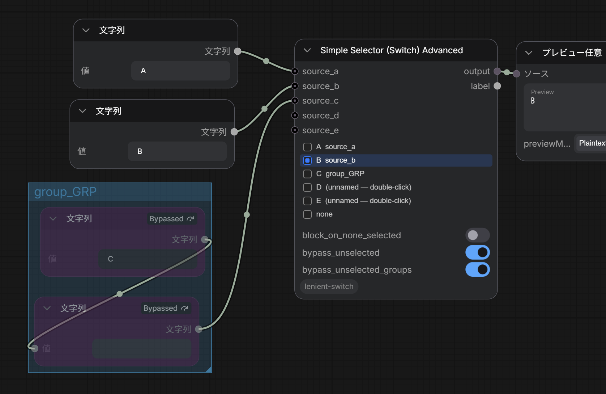

# Lenient Switch

A ComfyUI custom node that lets you **route any value through a switch while specifying the condition separately from the pass-through source**.

Most switch nodes force you to choose a slot based on the same value you forward downstream. Lenient Switch decouples those: each slot has its own optional *condition* input. If a condition is connected, it decides whether that slot wins; if not, the source itself is used for the test. This makes it easy to gate one signal on the truthiness of another (e.g. "forward the image when the mask is non-empty", "pick a prompt based on a flag").


|screenshot 1|screenshot 2|
|---|---|
|||

## Node

- Category: `Lenient Switch`
- Display name: `Lenient Switch`
- Class: `LenientSwitch`

### Inputs

| Slot | Required | Purpose |
| --- | --- | --- |
| `source_a` | yes | Pass-through source (any type) |
| `source_b`, `source_c`, `source_d`, `source_e` | no | Additional pass-through sources |
| `pass_if_a` … `pass_if_e` | no | Per-slot truthiness test (**not** a CONDITIONING input). If unconnected, the matching `source_X` is used as the condition |

Toggles (required):

| Toggle | Default | Effect when ON |
| --- | --- | --- |
| `treat_zero_as_false` | true | Numeric `0` / `0.0` is falsy |
| `treat_empty_string_as_false` | true | `""` is falsy |
| `evaluate_boolean` | true | Booleans use their actual value. When OFF, booleans are always truthy |
| `treat_empty_list_as_false` | true | Empty `list` / `tuple` is falsy |
| `block_on_all_false` | false | When every slot is falsy, emit an `ExecutionBlocker` on the `output` socket to stop downstream execution |
| `bypass_unselected` | false | Skip evaluating the `source_X` of slots that **can't** win, so their upstream chains don't run (see below) |

`None` is always falsy. Values that don't match any falsy rule are truthy.

#### `bypass_unselected` (lazy evaluation)

When ON, a slot is skipped — its `source_X` upstream chain is **not executed** — only when its `pass_if_X` is **connected and falsy** (a guaranteed loser). This is ComfyUI-native lazy evaluation, not an rgthree-style mode change: the skipped nodes simply don't run; they are not visually greyed out.

Slots whose `pass_if_X` is *unconnected* are always evaluated. Their condition is the source value itself, which can only be known by running the source, so they can't be skipped ahead of time. If you want a slot's upstream to be bypassable, wire its `pass_if_X`.

### Outputs

| Output | Type | Meaning |
| --- | --- | --- |
| `output` | any | The `source_X` of the first slot whose condition is truthy. `None` if all slots are falsy (or `ExecutionBlocker` if `block_on_all_false` is ON) |
| `matched` | BOOLEAN | `True` if a slot matched, `False` otherwise (always `False` when all slots are falsy, including the blocker case) |

### Evaluation order

Slots are tested in the order **A → B → C → D → E**. Slots whose `source_X` is not connected (C/D/E only) are skipped. The first slot whose condition evaluates truthy wins, and its `source_X` value is forwarded.

## Simple Selector (Switch)

- Category: `Lenient Switch`
- Display name: `Simple Selector (Switch)`
- Class: `SimpleSelectorSwitch`

A no-condition switch: instead of evaluating truthiness, you **explicitly pick which source to forward** from a dropdown. Each slot also carries a free-form label (a memo), and the chosen slot's label is re-emitted as a second output — handy for things like building a filename from the active choice.


### Inputs

| Input | Required | Purpose |
| --- | --- | --- |
| `select` | yes | Dropdown `none / A / B / C / D / E` — which source to forward. `none` forwards nothing |
| `label_a` … `label_e` | yes | Single-line per-slot memo (e.g. `SDXL base`). Not used for any flow decision; only the selected slot's label is re-emitted |
| `block_on_none_selected` | yes | When `select` is `none`, emit an `ExecutionBlocker` (on **both** outputs) to skip downstream nodes instead of passing `None` |
| `bypass_unselected` | yes | When ON, only the selected slot's `source_X` is evaluated; the upstream chains feeding the other sources (or all of them, when `select` is `none`) don't run (lazy evaluation, not an rgthree-style mode change) |
| `source_a` … `source_e` | no | Pass-through sources (any type). Wire only the slots you use |

### Outputs

| Output | Type | Meaning |
| --- | --- | --- |
| `output` | any | The `source_X` of the selected slot. `None` if `select` is `none` (or `ExecutionBlocker` if `block_on_none_selected` is ON), or if the selected slot's source is unconnected |
| `label` | STRING | The selected slot's label. Empty when `select` is `none` |

The selector is ComfyUI's stock dropdown — it gives "exactly one, or none" semantics natively with no extra UI. Selecting a slot whose `source_X` is unconnected returns `None` (it does **not** block); only `select = none` triggers the blocker.

## Simple Selector (Switch) Advanced

- Category: `Lenient Switch`
- Display name: `Simple Selector (Switch) Advanced`
- Class: `SimpleSelectorSwitchAdvanced`

Everything **Simple Selector (Switch)** does, but with a different frontend and an extra `bypass_unselected_groups` toggle that bypasses whole **canvas groups** in the rgthree [FastGroupsBypasser](https://github.com/rgthree/rgthree-comfy) style.



### Exclusive checkbox selector

Instead of the stock dropdown, this node shows an **exclusive checkbox list** (radio-style) — one row per slot plus a `none` row, exactly one ticked at a time:

```
[ ] A  base prompt
[■] B  detail prompt
[ ] C  (unnamed — double-click)
[ ] D  (unnamed — double-click)
[ ] E  (unnamed — double-click)
[ ] none
```

- **Click a row** to select that slot (or `none`). Flow behavior is identical to the plain node.
- **Double-click a slot row** to edit that slot's label in an inline dialog. (`none` has no label.)

The selector is a single custom widget: the choice and all five labels are stored together as the widget's value (a small JSON blob) and forwarded to the node — there is no separate dropdown or label fields. The selected slot's label is still re-emitted on the `label` output.

### Group bypass

When `bypass_unselected_groups` is ON, the canvas group **whose name matches each slot's label** is:

- set to **ALWAYS** for the **selected** slot, and
- set to **BYPASS** (mode 4 — the greyed-out rgthree look) for every **unselected** slot.

With `none` selected, every referenced group is bypassed. When the toggle is OFF, the referenced groups are restored to ALWAYS.

So each slot's label does double duty: it's the per-slot memo / re-emitted `label` output, **and** it names the group that slot turns on or off. Name your canvas groups to match the labels (e.g. a group titled `SDXL` for the slot whose label is `SDXL`).

Notes:

- This is a **pure frontend mode change** (it edits other nodes' `mode`, exactly like rgthree). The plain **Simple Selector (Switch)** node ships **no JS** and is unchanged — use it if you don't want any frontend behavior.
- It is **orthogonal** to `bypass_unselected` (the lazy-eval toggle). You can run either, both, or neither: lazy-eval controls *which source this node evaluates*; group bypass controls *which canvas groups are mode-4 bypassed*.
- Group membership is spatial (a node belongs to a group if it sits inside the group's box), so the toggle re-applies on selection / label changes and on workflow load. After restructuring groups, re-click a row to re-apply.

### Known limitation: properties panel

In **Nodes 2.0** (Vue rendering), selecting the node opens the right-hand properties panel, which draws the selector a **second time**. ComfyUI repaints only one of the two copies when you change the selection, so with the panel open the **node-body** checkboxes can momentarily show a stale choice until they next repaint (click, move, or reload). The selection itself is always correct — only the node-body redraw lags. Close the panel (deselect the node) for the normal, fully-synced view.

## Installation

Clone into your ComfyUI `custom_nodes` directory:

```bash
cd ComfyUI/custom_nodes
git clone https://github.com/id-fa/ComfyUI-Lenient-Switch lenient-switch
```

Restart ComfyUI. No additional dependencies required.

## License

[MIT](LICENSE)
