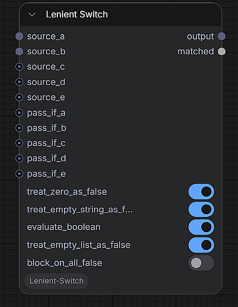
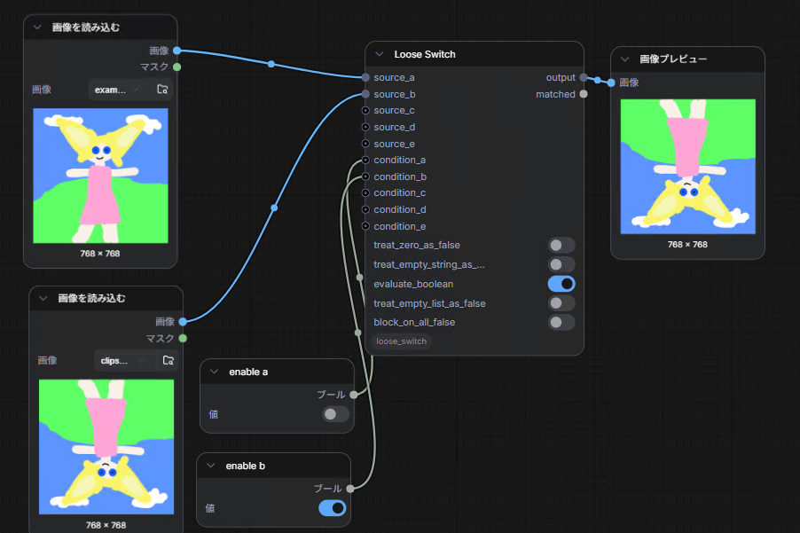
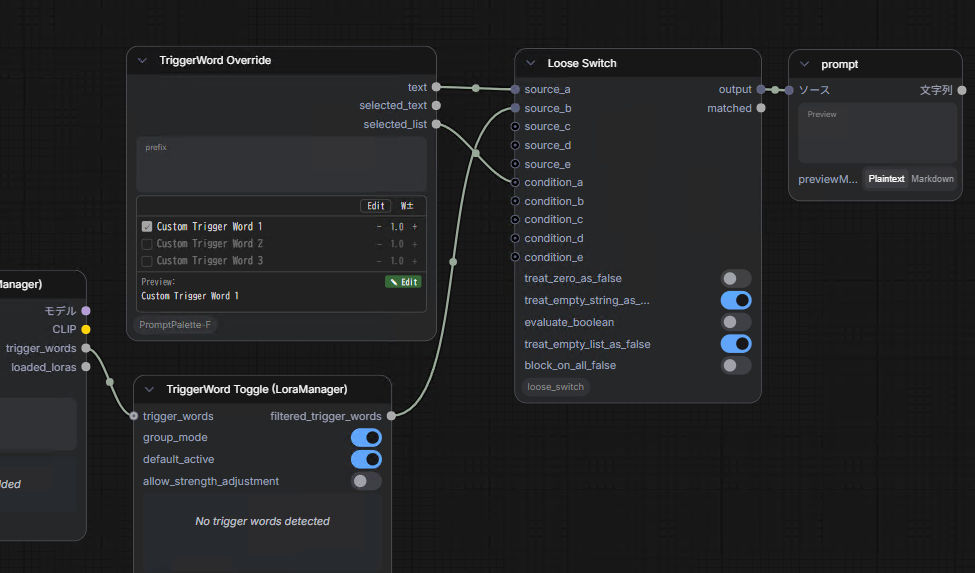
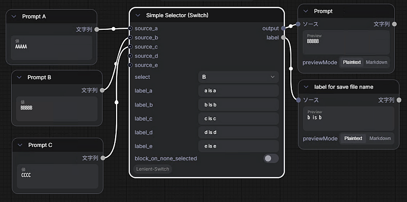

# Lenient Switch

A ComfyUI custom node that lets you **route any value through a switch while specifying the condition separately from the pass-through source**.

Most switch nodes force you to choose a slot based on the same value you forward downstream. Lenient Switch decouples those: each slot has its own optional *condition* input. If a condition is connected, it decides whether that slot wins; if not, the source itself is used for the test. This makes it easy to gate one signal on the truthiness of another (e.g. "forward the image when the mask is non-empty", "pick a prompt based on a flag").



|screenshot 1|screenshot 2|
|---|---|
|||

## Node

- Category: `utils`
- Display name: `Lenient Switch`
- Class: `LenientSwitch`

### Inputs

| Slot | Required | Purpose |
| --- | --- | --- |
| `source_a` | yes | Pass-through source (any type) |
| `source_b`, `source_c`, `source_d`, `source_e` | no | Additional pass-through sources |
| `pass_if_a` … `pass_if_e` | no | Per-slot truthiness test (**not** a CONDITIONING input). If unconnected, the matching `source_X` is used as the condition |

Toggles (required):

| Toggle | Default | Effect when ON |
| --- | --- | --- |
| `treat_zero_as_false` | true | Numeric `0` / `0.0` is falsy |
| `treat_empty_string_as_false` | true | `""` is falsy |
| `evaluate_boolean` | true | Booleans use their actual value. When OFF, booleans are always truthy |
| `treat_empty_list_as_false` | true | Empty `list` / `tuple` is falsy |
| `block_on_all_false` | false | When every slot is falsy, emit an `ExecutionBlocker` on the `output` socket to stop downstream execution |

`None` is always falsy. Values that don't match any falsy rule are truthy.

### Outputs

| Output | Type | Meaning |
| --- | --- | --- |
| `output` | any | The `source_X` of the first slot whose condition is truthy. `None` if all slots are falsy (or `ExecutionBlocker` if `block_on_all_false` is ON) |
| `matched` | BOOLEAN | `True` if a slot matched, `False` otherwise (always `False` when all slots are falsy, including the blocker case) |

### Evaluation order

Slots are tested in the order **A → B → C → D → E**. Slots whose `source_X` is not connected (C/D/E only) are skipped. The first slot whose condition evaluates truthy wins, and its `source_X` value is forwarded.

## Simple Selector (Switch)

- Category: `utils`
- Display name: `Simple Selector (Switch)`
- Class: `SimpleSelectorSwitch`

A no-condition switch: instead of evaluating truthiness, you **explicitly pick which source to forward** from a dropdown. Each slot also carries a free-form label (a memo), and the chosen slot's label is re-emitted as a second output — handy for things like building a filename from the active choice.



### Inputs

| Input | Required | Purpose |
| --- | --- | --- |
| `select` | yes | Dropdown `none / A / B / C / D / E` — which source to forward. `none` forwards nothing |
| `label_a` … `label_e` | yes | Single-line per-slot memo (e.g. `SDXL base`). Not used for any flow decision; only the selected slot's label is re-emitted |
| `block_on_none_selected` | yes | When `select` is `none`, emit an `ExecutionBlocker` (on **both** outputs) to skip downstream nodes instead of passing `None` |
| `source_a` … `source_e` | no | Pass-through sources (any type). Wire only the slots you use |

### Outputs

| Output | Type | Meaning |
| --- | --- | --- |
| `output` | any | The `source_X` of the selected slot. `None` if `select` is `none` (or `ExecutionBlocker` if `block_on_none_selected` is ON), or if the selected slot's source is unconnected |
| `label` | STRING | The selected slot's label. Empty when `select` is `none` |

The selector is ComfyUI's stock dropdown — it gives "exactly one, or none" semantics natively with no extra UI. Selecting a slot whose `source_X` is unconnected returns `None` (it does **not** block); only `select = none` triggers the blocker.

## Installation

Clone into your ComfyUI `custom_nodes` directory:

```bash
cd ComfyUI/custom_nodes
git clone https://github.com/id-fa/ComfyUI-Lenient-Switch
```

Restart ComfyUI. No additional dependencies required.

## License

[MIT](LICENSE)
